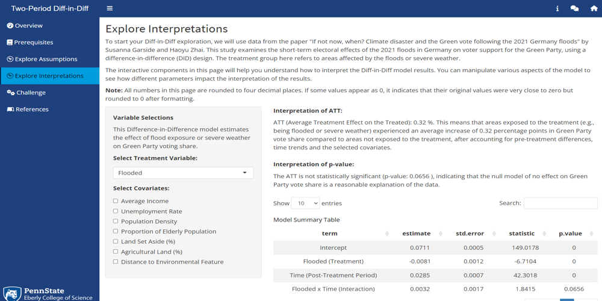

# Two-Period Difference-in-Difference Regression

 

# App Description
This app is designed to help students explore and understand the core concepts, 
assumptions and interpretations of Two-Period Difference-in-Difference (Diff-in-Diff) Regression by experimenting with simulation and real life data.
